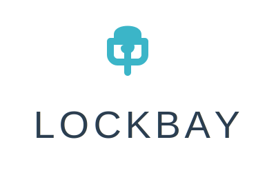

# 🎨 Official Lockbay Logo Variations & Usage Guide

## Logo Design Concept

The Lockbay logo brilliantly combines:
- **$ (Dollar Sign)** - Represents financial transactions and money
- **🔒 (Padlock)** - Symbolizes security and protection
- **Clean Typography** - Modern, lightweight sans-serif font

The dollar sign cleverly forms a padlock shape, perfectly embodying "secure financial transactions."

---

## 📦 Available Logo Files

### 1. **lockbay_official_horizontal.svg**
**Primary Logo** - Full horizontal layout
- Icon + Text side by side
- Best for: Website headers, email signatures, documents
- Dimensions: Wide format
- Color: Teal (#3BB5C8) icon + Dark gray text

### 2. **lockbay_icon_official.svg**
**Icon Only** - Just the $ padlock symbol
- Best for: App icons, favicons, social media profile pictures
- Dimensions: Square format
- Color: Teal (#3BB5C8)

### 3. **lockbay_white_official.svg**
**White Version** - For dark backgrounds
- Full logo in white
- Best for: Dark mode websites, dark social media posts, presentations
- Color: All white (#FFFFFF)

### 4. **lockbay_black_official.svg**
**Black Version** - Monochrome
- Full logo in black
- Best for: Print materials, formal documents, black & white contexts
- Color: All black (#000000)

### 5. **lockbay_stacked_official.svg**
**Vertical/Stacked Layout** - Icon above text
- Best for: Tall/narrow spaces, mobile screens, badges
- Dimensions: Vertical format
- Color: Teal icon + Dark gray text

### 6. **lockbay_icon_circle.svg**
**Circular Badge** - Icon in circle
- Best for: Social media profiles (circular crop), badges, stickers
- Dimensions: Square with circular background
- Color: Teal with light background circle

### 7. **lockbay_favicon.svg**
**Favicon** - Simplified for tiny sizes
- Best for: Browser tabs, bookmarks, very small applications
- Dimensions: 32x32px optimized
- Color: Teal (#3BB5C8)

---

## 🎨 Official Brand Colors

### Primary Color
```
Teal/Turquoise: #3BB5C8
RGB: (59, 181, 200)
```
**Use for:** Icon, accent elements, call-to-action buttons

### Secondary Color
```
Dark Navy/Charcoal: #2C3E50
RGB: (44, 62, 80)
```
**Use for:** Text, "LOCKBAY" wordmark

### Supporting Colors
```
White: #FFFFFF (backgrounds, dark mode logo)
Black: #000000 (monochrome applications)
Light Gray: #ECEFF1 (backgrounds)
```

---

## 📐 Logo Sizing Guidelines

### Minimum Sizes (Maintain Legibility)

**Full Logo (Horizontal)**
- Minimum width: 180px (digital)
- Minimum width: 2 inches (print)

**Icon Only**
- Minimum size: 32x32px (digital)
- Minimum size: 0.5 inches (print)

**Stacked Logo**
- Minimum width: 120px (digital)
- Minimum width: 1.5 inches (print)

---

## ✅ Logo Usage Do's

✅ **DO:**
- Use the official logo files provided
- Maintain original proportions (don't stretch)
- Ensure adequate clear space (minimum = height of lock icon)
- Use white version on dark backgrounds
- Use black version for monochrome printing
- Keep the logo crisp and clear
- Use icon only for profile pictures and small spaces

---

## ❌ Logo Usage Don'ts

❌ **DON'T:**
- Change the teal color to other colors
- Rotate or skew the logo
- Add shadows, gradients, or effects
- Place on busy backgrounds without contrast
- Stretch or compress the logo
- Separate the icon from text inappropriately
- Recreate or redraw the logo
- Use low-resolution versions

---

## 📱 Social Media Specifications

### Profile Pictures (Use Icon Only)

**Instagram:** 320x320px
- File: `lockbay_icon_circle.svg` or `lockbay_icon_official.svg`

**Twitter/X:** 400x400px
- File: `lockbay_icon_circle.svg`

**LinkedIn:** 400x400px
- File: `lockbay_icon_official.svg`

**Telegram:** 512x512px
- File: `lockbay_icon_official.svg` (scaled up)

**Facebook:** 180x180px
- File: `lockbay_icon_circle.svg`

### Cover/Header Images

**Twitter/X Header:** 1500x500px
- Use full logo with branded background
- Position logo left or center

**LinkedIn Cover:** 1584x396px
- Use full horizontal logo
- Add tagline: "Secure Crypto Escrow on Telegram"

**Facebook Cover:** 820x312px
- Use full horizontal logo

---

## 🖨️ Print Specifications

### Business Cards
- Use: `lockbay_official_horizontal.svg`
- Minimum size: 2 inches width
- Format: CMYK color mode
- Resolution: Vector (SVG) or 300 DPI minimum

### Letterhead
- Use: `lockbay_official_horizontal.svg` (top left)
- Or: `lockbay_stacked_official.svg` (centered)

### Merchandise (T-shirts, Mugs, Stickers)
- Use: Any variation based on product
- Ensure vector format for scalability
- White version for dark colored items

---

## 🌐 Web Usage

### Website Header/Navigation
```html

```

### Favicon (Browser Tab)
```html
<link rel="icon" type="image/svg+xml" href="lockbay_favicon.svg">
```

### Footer
```html

```

---

## 🎯 Which Logo to Use When?

| Context | Recommended File |
|---------|-----------------|
| Website header | `lockbay_official_horizontal.svg` |
| Social media profile | `lockbay_icon_circle.svg` |
| Social media posts (light bg) | `lockbay_official_horizontal.svg` |
| Social media posts (dark bg) | `lockbay_white_official.svg` |
| Email signature | `lockbay_official_horizontal.svg` |
| App icon | `lockbay_icon_official.svg` |
| Favicon | `lockbay_favicon.svg` |
| Print materials | `lockbay_official_horizontal.svg` |
| Black & white printing | `lockbay_black_official.svg` |
| Mobile app splash screen | `lockbay_stacked_official.svg` |
| Badge/seal | `lockbay_icon_circle.svg` |
| Telegram bot avatar | `lockbay_icon_official.svg` |

---

## 📏 Clear Space Requirements

Maintain clear space around the logo equal to the **height of the lock icon** on all sides.

**Example:**
```
|---- Lock Icon Height ----|
        [CLEAR SPACE]
              
              [$] LOCKBAY
              
        [CLEAR SPACE]
```

This ensures the logo has breathing room and remains impactful.

---

## 🎨 Background Recommendations

### Light Backgrounds
- Use: Standard teal/gray logo
- Background colors: White, Light Gray (#ECEFF1), Cream

### Dark Backgrounds
- Use: White version
- Background colors: Navy, Black, Dark Gray, Dark Teal

### Colored Backgrounds
- Ensure high contrast
- Test readability
- Use white or black version if needed

---

## 💾 File Format Guide

### SVG (Scalable Vector Graphics)
- **Best for:** Web, apps, any digital use
- **Advantages:** Infinite scalability, small file size
- **Use:** Default choice for all digital applications

### PNG (Portable Network Graphics)
- **Best for:** When SVG isn't supported
- **Advantages:** Transparency support
- **Export at:** 2x or 3x resolution for retina displays

### JPG (JPEG)
- **Best for:** Print when vector isn't available
- **Disadvantages:** No transparency
- **Export at:** 300 DPI minimum

### PDF
- **Best for:** Professional print materials
- **Advantages:** Vector quality in print-ready format

---

## 🚀 Quick Reference

**Need logo for website?**
→ `lockbay_official_horizontal.svg`

**Need profile picture?**
→ `lockbay_icon_circle.svg`

**Need dark mode logo?**
→ `lockbay_white_official.svg`

**Need favicon?**
→ `lockbay_favicon.svg`

**Need for print?**
→ `lockbay_official_horizontal.svg` or black version

---

## 📞 Logo Support

If you need:
- Different file formats (PNG, JPG, PDF)
- Custom sizing
- Special color variations
- Print-ready files

Contact the design team or use online SVG converters for format changes.

---

**Logo Design Philosophy:**
"Simple, secure, sophisticated. The dollar sign lock represents our core mission: protecting your financial transactions with elegance and efficiency."
